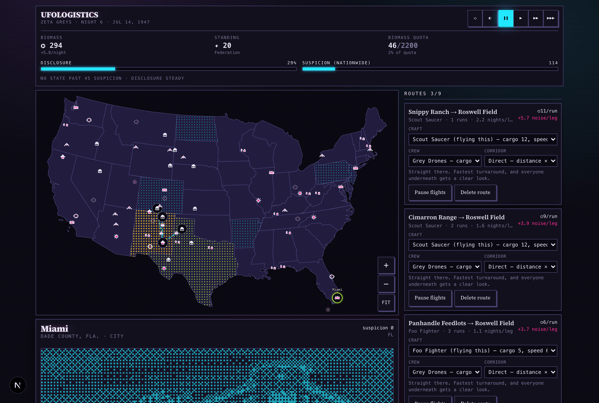
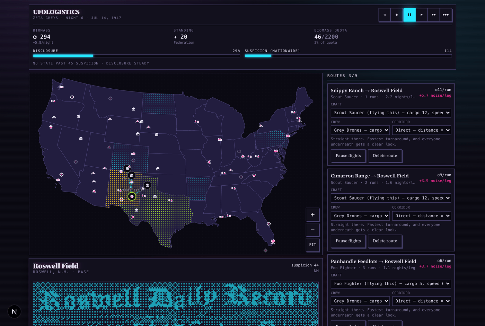
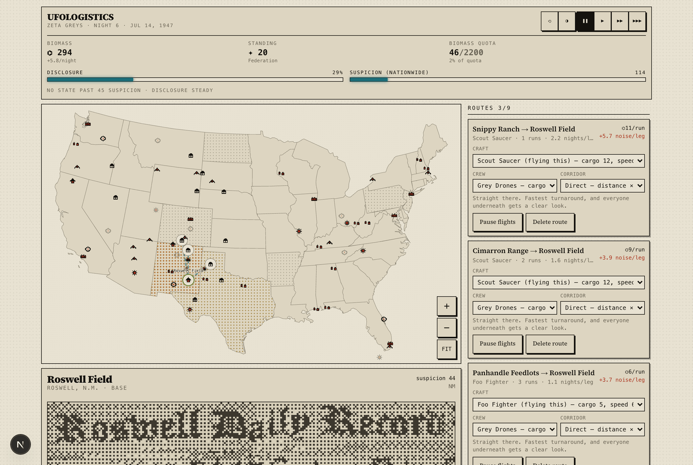
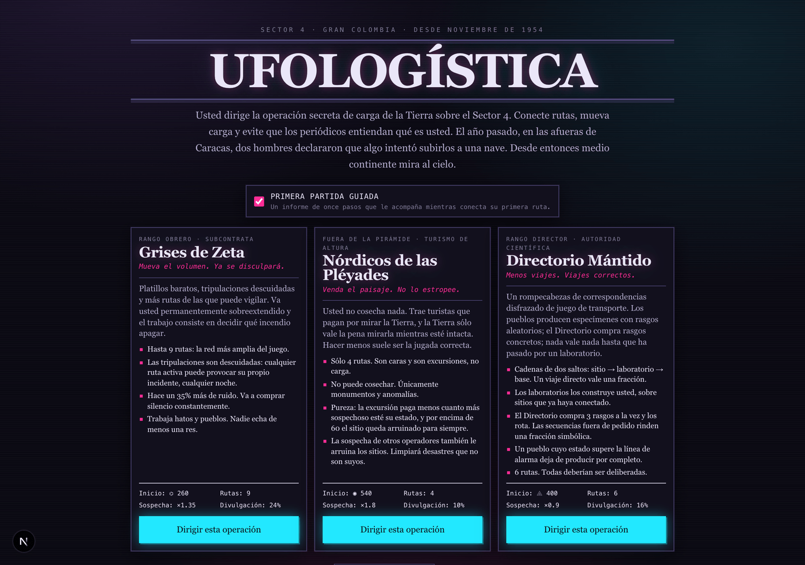
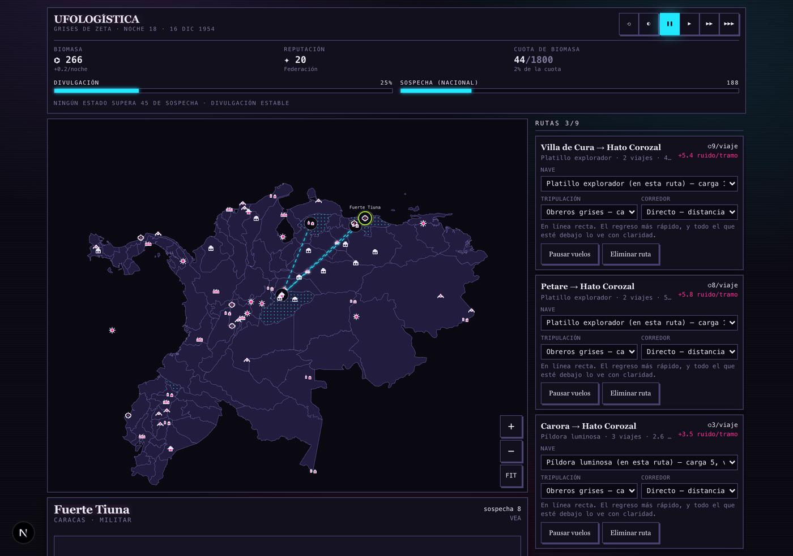

# Ufologistics

A 2D, newspaper-and-pixel-art transport game. You run Earth's secret freight operation
from a map of the United States, 1947 onward — wire routes, move cargo, and keep the
papers from working out what you are.

Browser only, mobile friendly, works offline once loaded. Ships in two editions: a neon
**night** print (default) and the original **newsprint day** print.



```bash
npm install
npm run dev          # http://localhost:3000
```

## The one rule

Three words, one chain: **NOISE → SUSPICION → DISCLOSURE.**

Your craft make noise. Noise raises suspicion in every state a route passes over, not
just at its endpoints — so a long pretty route is usually worse than a short ugly one.
Suspicion cools on its own, but any state left **above 45** leaks into Disclosure every
night. Disclosure is the loss meter: at 100% your licence is revoked and the run ends.

Disclosure never falls by itself. Buying a story off when a newspaper stops the clock is
the only thing in the game that pushes it back down.

## The three races

Same map, three genuinely different games.

| | Zeta Greys | Pleiadian Nordics | Mantid Directorate |
|---|---|---|---|
| Home | Roswell | Mt Shasta | Dulce |
| Routes | 9 | 4 | 6 |
| Goal | 2,200 biomass | 1,900 hours of footage | 55 sequence-grades |
| The game | triage — too many routes, sloppy crews, permanently on fire | restraint — you harvest nothing, and touring a hot state spoils the site for good | chains — two hops through labs you build yourself |


## Playing

Tap a site → **Wire a route from here** → tap a lit destination. Craft then shuttle that
route forever without further instruction.

Each route has three dials — **craft**, **crew** and **corridor** — trading cargo and
speed against noise. Corridors run from Direct (fastest, loudest) to Strict Night Ops
(quietest in the game, and it wastes most of the day waiting).

Every 9–22 nights a newspaper stops the clock and asks you something. Minor items settle
themselves and turn up in Dispatches instead.

Space bar pauses, or tap ❚❚. ◐ in the HUD switches edition. The seed box on the title
screen makes a run reproducible. New here? Leave **Guided first run** ticked — an 11-step
briefing walks you through wiring your first route.

## Scripts

| | |
|---|---|
| `npm run check` | typecheck + lint + site-placement + event-deck audits |
| `npm run sim` | headless balance harness, 40 seeds per race |
| `npm run artifact` | bundle the whole game into one self-contained HTML file |
| `npm run genmap` | regenerate `src/game/usmap.ts` from Natural Earth |
| `npm run genphotos` | re-fetch and re-dither site plates from Wikimedia Commons |

## Layout

```
src/game/        engine, data, no framework imports — runs headless under tsx
src/game/events/ 104 slot-templated event definitions
src/components/  the React layer, all of it client-side
scripts/         generators and the balance harness
```

`src/game/engine.ts` is a pure `(state, action) => state` reducer with no React or DOM
dependency, which is what lets `npm run sim` play thousands of games headlessly. All
tuning lives in one `TUNE` object at the top of that file — the numbers there were set
from simulation output, not intuition.

## Two editions

Every site has a halftone plate — a real public-domain photograph reduced to 1-bit
ordered dither and tinted through a CSS mask, so it recolours with the edition.

| Night (default) | Day |
|---|---|
|  |  |

## Credits

Site photographs come from **Wikimedia Commons**, filtered to public-domain and CC0
sources only, then reduced to 1-bit ordered dither. Per-image licence, author and source
page are recorded in `src/game/photos.ts` and shown in-game beneath each plate.

State geometry is from **Natural Earth** (public domain), projected to Albers Equal Area
Conic by `scripts/genmap.mjs`.

## Segunda edición: Gran Colombia

A second, fully Spanish edition lives at [`/gran-colombia`](src/app/gran-colombia). It is
not a translation — it is its own map, its own sites and its own event deck, written in
Spanish rather than run through one. Colombia, Venezuela, Ecuador and Panama, 92
provinces, opening on the Venezuelan humanoid wave of November 1954.



The sites are real cases: the Cueva de los Tayos in Morona Santiago (Moricz's claimed
metal library, and the 1976 expedition that had Neil Armstrong as honorary president) is
the Mantid base; the Sierra Nevada de Santa Marta, which the Kogi call the Heart of the
World, is the Nordic base; the Casanare llanos are the Grey base. Villa de Cura, Petare
and Carora carry the 1954 encounters. The Relámpago del Catatumbo — real lightning on
~260 nights a year, used for centuries as a navigational beacon — is the best natural
cover on the map.



**The engine is shared, not copied.** `engine.ts`, `deck.ts` and the type layer are
imported by both editions; `content.ts` holds a pack per edition (map, sites, races,
craft, deck, calendar, and the strings the engine itself emits) and `GameState.edition`
selects one. The reducer stays pure, so `npm run sim` plays either edition through
exactly the same code path:

```bash
npm run sim                      # US edition
npx tsx scripts/sim.ts 400 40 gc # Gran Colombia
```

Two things the balance sim caught that playtesting would have taken weeks to find. Gran
Colombia is a far more compact region, so a Nordic leg completes in 4.3 nights instead of
7.4 — at the US noise multiplier that produced 1.7× the suspicion per night, and because
Nordic payouts scale *down* with suspicion while upkeep does not, the race went bankrupt
in 40 runs out of 40. And the site risk values had been authored 25–40% above the US
distribution, which quietly made the whole edition noisier. Both are fixed; the two
editions now land within a few nights of each other:

| | grey | nordic | mantid |
|---|---|---|---|
| US | 40/40 · 188n | 38/40 · 166n | 35/40 · 167n |
| Gran Colombia | 40/40 · 189n | 40/40 · 160n | 40/40 · 153n |

## Licence

[MIT](LICENSE) — use it, fork it, ship it, sell it. The only condition is that the
copyright notice travels with it.

If you build something on this, a credit is genuinely appreciated:

> Based on [Ufologistics](https://github.com/josephwilliams/ufologistics) by Joseph Williams.

The MIT terms cover the code. The site photographs are separately public-domain or CC0
(see Credits above) and carry no restrictions of their own.

## Design notes

[`DESIGN.md`](DESIGN.md) — what the game is and how it is built.

[`SPIKE.md`](SPIKE.md) and `design/*.md` are an earlier, much larger concept (3D globe,
five levels, procedural galaxy). Kept for reference; superseded by `DESIGN.md`.
